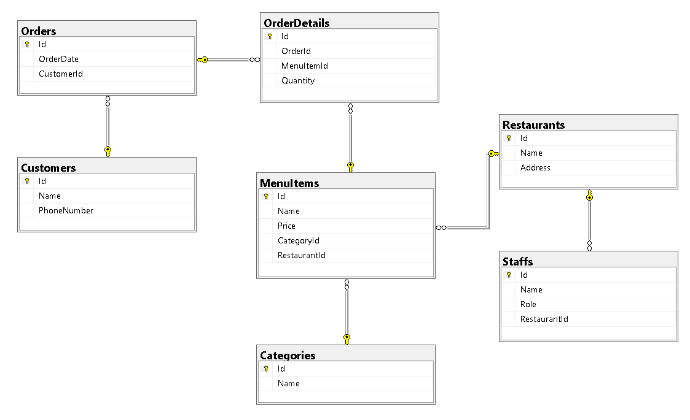

# Take-out App #
## Description ##
A mobile app for ordering take-out food with a simple, user-friendly interface, supporting restaurant browsing, menu selection, and secure payments. Built using ASP.NET Core 6 Web API, Java.
## Design ##
[Take-out App UI](https://www.figma.com/design/0P8KNKlTe3ylEPczJiy6aK/Take%E2%80%93Out-App?node-id=0-1&t=lU8vykyCJnycPXmr-1)
## Database ##
Using SQL Server with Entity Framework Core (Code First).

